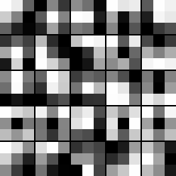
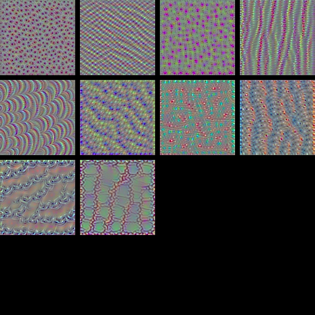
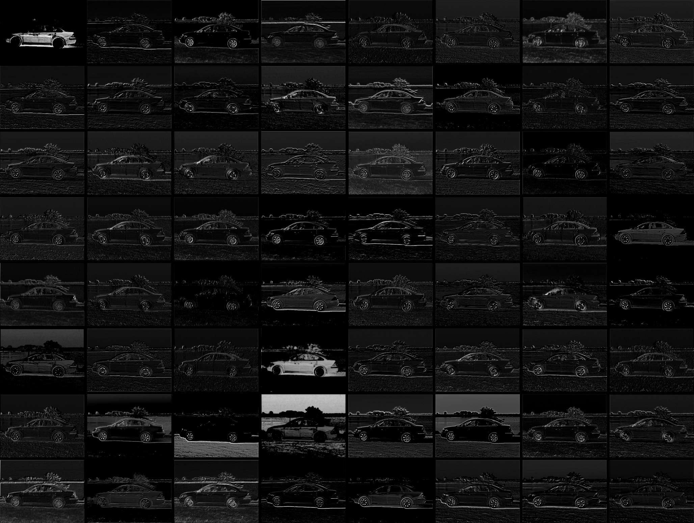

# Neural network visualization

Outputs visualizations of internal outputs and kernels. Uses VGG16.

Sample outputs:

* Kernels:

* Inputs that activate a certain feature map:

* Visualization of intermediate layers ([using this car image, from ImageNet](http://farm4.static.flickr.com/3091/2863284113_26b5639905.jpg)):

